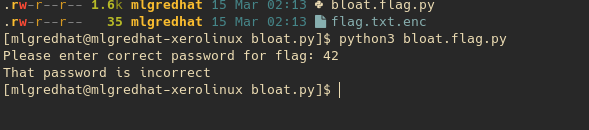
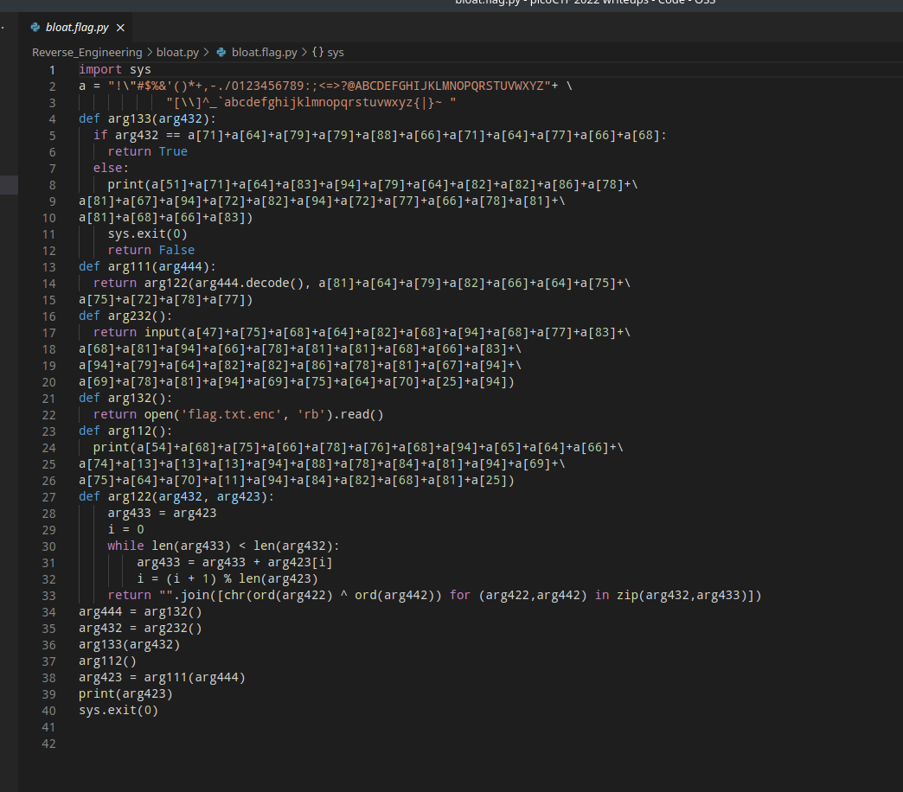
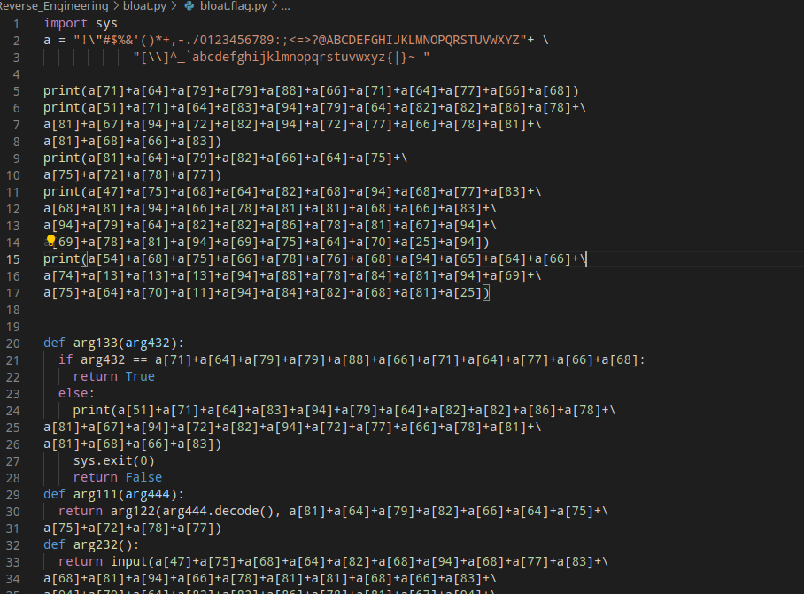
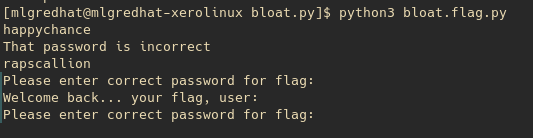
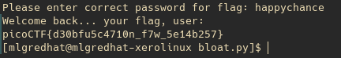

<h1 align="center">Bloat.py</h1>

We are given two files <b>Bloat.py</b> and <b>flag.txt.enc</b> to work with. when running bloat.py it asks us for a password and exits if we get it wrong.

When we open the file in vscode we can see this "a" variable that has a bunch of characters. We can also see what looks like strings in the code encrypted with this variable.

You can see to print statments in the code which probably print "Please enter the correct password for flag:" and "That password is incorrect" which gave me the idea to just add some print statments with the other strings.

After I put the print statments in there I ran it again and sure enough it prints some strings out.

I tried using the first string it printed out which was happychance and it worked! I was able to get the flag and complete the challenge.

